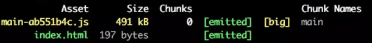
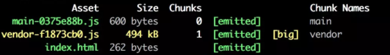
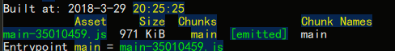
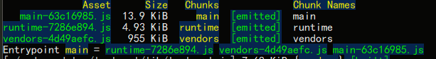
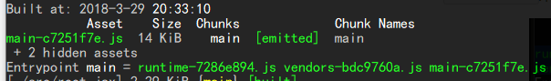

# webpack v4.0 不完全指北

> webpack 是一个开源的前端打包工具。它提供了前端开发缺乏的模块化开发方式，将各种静态资源视为模块，并从中生成优化过的代码。webpack可以从终端或者修改 webpack.config.js 文件来设置各项功能。在今年的2月25日，webpack 团队发布了他们的 4.0.0 版本。


### webpack 更好的默认值

**webpack v4.0** 之前，我们需要在config文件中定义入口文件和输出文件，但是在新版本中，webpack终于给定了默认值这个概念，新版本中的 `entry` 和 `output `的默认值分别是 `./src/index.js` 、 `./dist/main.js` 。所以理论上新版本 **webpack** 是一个可以无需配置就能hello world的前端打包工具。


### Node环境

**webpack v4.0** 已不再支持Node.js v4.0，**webpack**作者同时提醒用户尽量使用Node v8.9.4或者更高版本。


### CLI 到 webpack-cli

```shell
The CLI moved into a separate package: webpack-cli.
Please install 'webpack-cli' in addition to webpack itself to use the CLI.
-> When using npm: npm install webpack-cli -D
-> When using yarn: yarn add webpack-cli -D
```

`webpack-cli` 是 `webpack` 运行的命令行接口，常用配置包括输出配置、环境配置等。在4.0版本之前，`webpack-cli` 是随webpack本身安装的，但是在4.0版本中，webpack团队把这个接口单独拿了出来做成了一个包。


### mode 运行模式

在4.0里，你必须要选择一个运行模式，可以在配置文件中配置 `mode` 或者是npm scripts 里 `--mode` 。`mode`  有两种可能性，`development` 和 `production` 。

生产模式和开发模式：

当然了，开发者可以使用 `optimization.* ` 自定义运行模式。

还有一个隐藏属性—— `none` ,禁用所有属性。


### R.I.P CommonsChunkPlugin

------

`CommonsChunkPlugin`  是什么？
在使用 **webpack** 构建工程的时候，我们并不会把一整个项目的代码全部打到一个包里，那样在项目打包的时候就会非常缓慢。

例如我们现在在写的 react + antd 项目，项目中很只管的分为两个部分：一部分是业务代码，比如页面展示，页面交互等等；另一部分是项目中引用的资源库，例如 react、antd。当我们运行项目的时候，很显然 react 这样的资源包我们并不需要每一次都重新打包，我们需要打包的只是业务代码。

于是又牵扯到另一个话题，那就是**持久缓存**，让 react 这样的资源包缓存到项目中，每次只需要更新修改过的业务代码就ok。 每次运行的时候 **webpack** 会有一个 `chunkhash` ，有了这个 `chunkhash` 就能够让输出的文件名保持唯一性：

```javascript
output: {
    path: path.join(__dirname, 'dist/js'),
    filename: '[name]-[chunkhash:8].js',
    chunkFilename: 'chunks/[name].[chunkhash:8].js'
},
```

打包完成是这样



这样的配置能够实现**持久缓存**，但是又存在另一个问题，这并没有把两部分代码分离开。**webpack** 提供了一个`CommonsChunkPlugin` 插件，能够把功能不同的代码打包到不同的包里，按需加载：

```javascript
new webpack.optimize.CommonsChunkPlugin({
    name: 'vendor',
    minChunks: function(module) {
    return /node_modules/.test(module.context);
    }
})
```



这块代码把资源包打包到 `vendor` 里，其它部分不变，那么就实现了业务代码与资源代码分离开。但是 **webpack** 在这里就有一个 bug 了，这个 bug 据说存在了三年还未解决，那就是—— `hash`。

按照上面的想法，那就是 vendor.js 应该是打包了一次以后就再也不用动了，除非我们引入了新的资源包，也就是说 vendor.js 后的 `hash` 应该是永远不会变的。然而 `CommonsChunkPlugin` 做不到这一点。

------


于是在 **webpack 4** 中 `CommonsChunkPlugin` 直接被拆成了两个插件 `splitChunks` 和 `runtimeChunk`

`splitChunks`这个配置项用来实现分割模块的功能：把共用的代码分割出来，减少重复代码的加载，对应 **webpack** 的模块化开发、按需加载的理念。

```javascript
...
 
optimization: {
    splitChunks: {
        chunks: "initial",               // 必须三选一： "initial" | "all"(默认就是all) | "async" 
        minSize: 0,                      // 最小尺寸，默认0
        minChunks: 1,                    // 最小 chunk ，默认1
        maxAsyncRequests: 1,             // 最大异步请求数， 默认1
        maxInitialRequests : 1,          // 最大初始化请求书，默认1
        name: function(){},              // 名称，此选项可接收 function
        cacheGroups:{                    // 这里开始设置缓存的 chunks
            priority: 0,                 // 缓存组优先级
            vendor: {                    // entry中定义的 入口名称
                chunks: "initial",       // 必须三选一： "initial" | "all" | "async"(默认就是异步) 
                test: /react|lodash/,    // 正则规则验证，如果符合就提取 chunk
                name: "vendor",          // 要缓存的 分隔出来的 chunk 名称 
                minSize: 0,
                minChunks: 1,
                enforce: true,
                maxAsyncRequests: 1,     // 最大异步请求数， 默认1
                maxInitialRequests : 1,  // 最大初始化请求书，默认1
                reuseExistingChunk: true // 可设置是否重用该chunk（查看源码没有发现默认值）
            }
        }
    }
 }
```

`runtimeChunk` 来管理缓存方面的配置，它有两个值 `true` 和 `false` ，或者可以自定义runtime生成的文件名

```javascript
runtimeChunk: {
    name: 'runtime'
}
```


- 当不使用 `splitChunks` ，修改业务代码



- 使用 `splitChunks` 运行后



- 使用 `splitChunks` 修改业务代码并且下载新的资源包并引入


- 使用 `splitChunks` 修改业务代码




### module支持类型提升

**webpack4** 之前模块类型只支持js一种类型，但是在新版本中模块支持 `.mjs`, `.js`, `.json`, `.wasm` 等类型的模块。因此**webpack**在 `module.rules` 新增了 `type` 属性，用来支持不同的模块类型。

- javascript/esm (EcmaScript)
- javascript/dynamic (CommonJS)
- json
- javascript/auto (包含以上三种)
- webassembly

> WebAssembly 或称 wasm 是一个实验性的低级编程语言，应用于浏览器内的客户端。WebAssembly 是便携式的抽象语法树，被设计来提供比 JavaScript 更快速的编译及运行

```javascript
module: {
    rules: [
        {
            test: /\.txt/,
            loader: "raw-loader"
        },
        {
            test: /\.json/,
            loader: "file-loader",
            type: "javascript/auto"
        }
    ]
}
```


### 参考文献

https://github.com/webpack/webpack/releases

https://auth0.com/blog/webpack-4-release-what-is-new/?utm_source=dev&utm_medium=sc&utm_campaign=webpack4_new

https://webpack.toobug.net/zh-cn/chapter3/common-chunks-plugin.html

https://scotch.io/amp/tutorials/whats-new-in-webpack-4?__twitter_impression=true

https://www.robinwieruch.de/minimal-react-webpack-babel-setup/

https://gist.github.com/sokra/1522d586b8e5c0f5072d7565c2bee693
